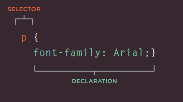
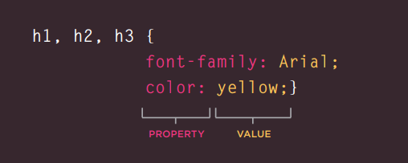
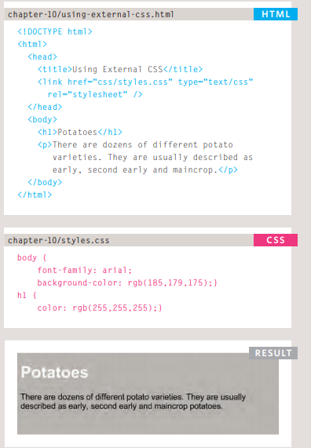
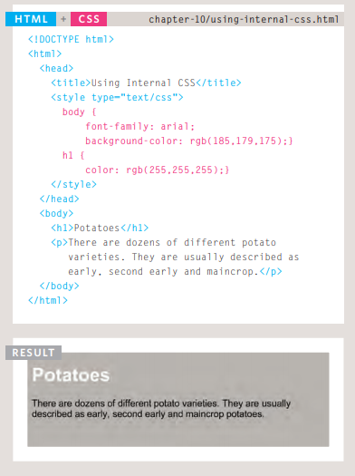
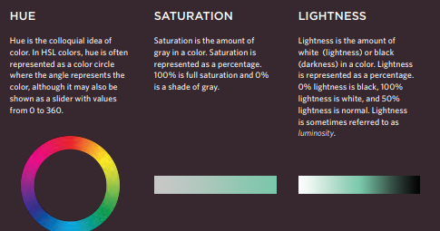

# Ch.10: Introducing CSS
- **CSS Associates Style rules with HTML elements**
- **These rules govern how the content of specified elements should be displayed**
- A CSS rule contains two parts:
a selector  and  declaration

1. This rule indicates that all 
 elements should be shown in the Arial typeface. 
2. Selectors indicate which element the rule applies to.

3. Declarations indicate how the elements referred to in the selector should be styled 
---------------------------
**CSS Properties Affect How Elements Are Displayed**

## 1. Using External CSS:

## 2. Using Internal CSS:

## 3. Inline Style
> < body >

>  < p style=color:red;" >.....< p >

>< / body >
----------------------------
# Ch.11: Colour :
### 1. Color Names
 > ex: 
 >
 > color:blue;
### 2. Hex Codes
> 00->FF
>
> ex:
>  #66cdaa
### 3. RGB Value 
>Values for red, green, and blue are expressed as numbers(between 0 and 255.)
>
> rgb(102,205,170)
 
### 4. Opacity, rgba
>The CSS3 rgba property allows you to specify a color, just like you would with an RGB value, but adds a fourth value to indicate opacity. This value is known as an alpha value and is a number between 0.0 and 1.0
### 5.  HSL Colors 

 

